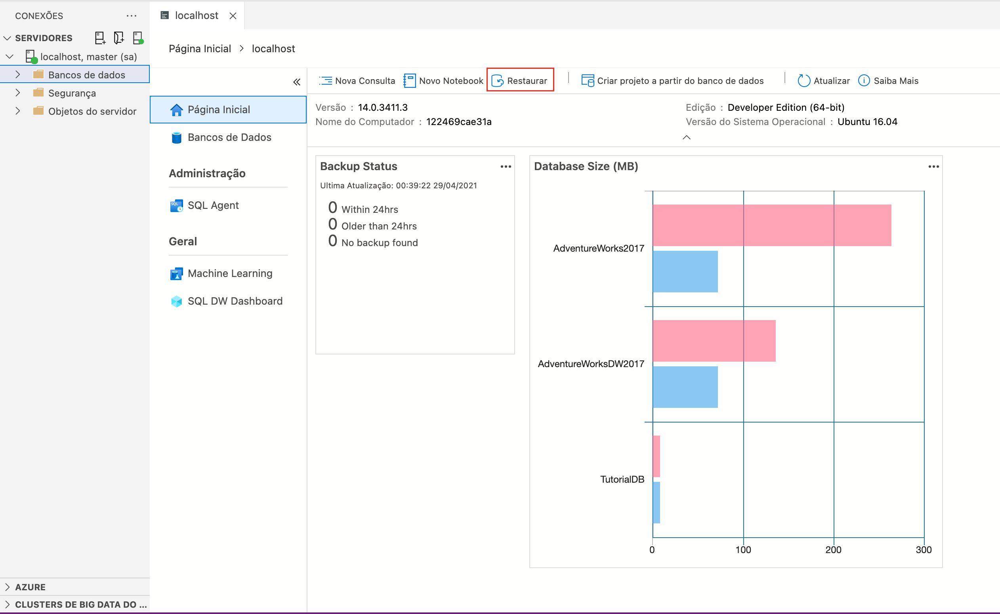
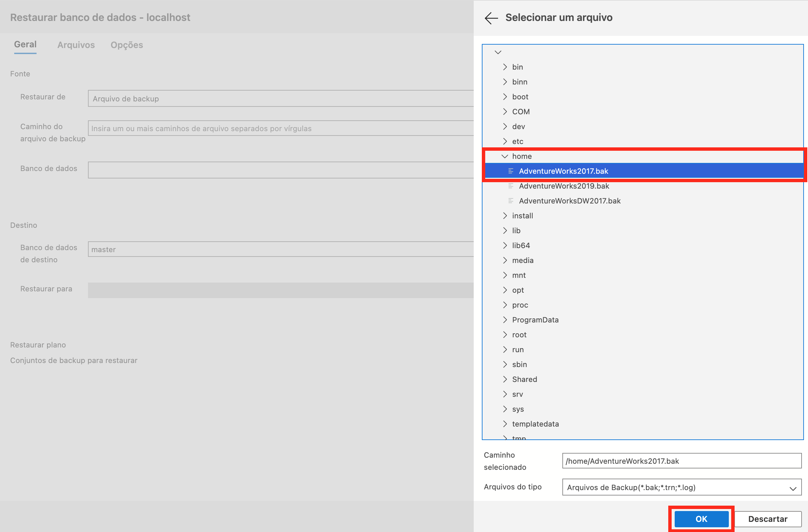
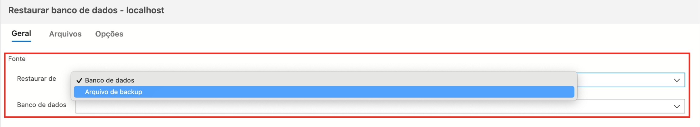
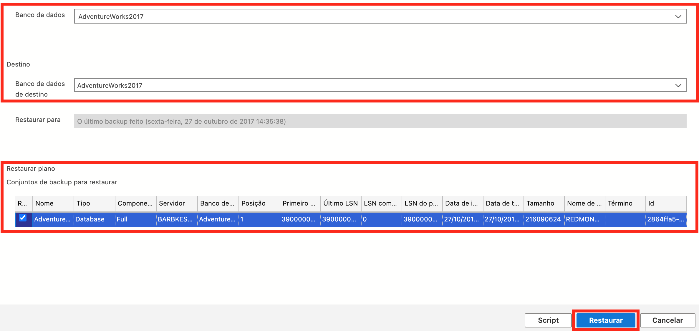
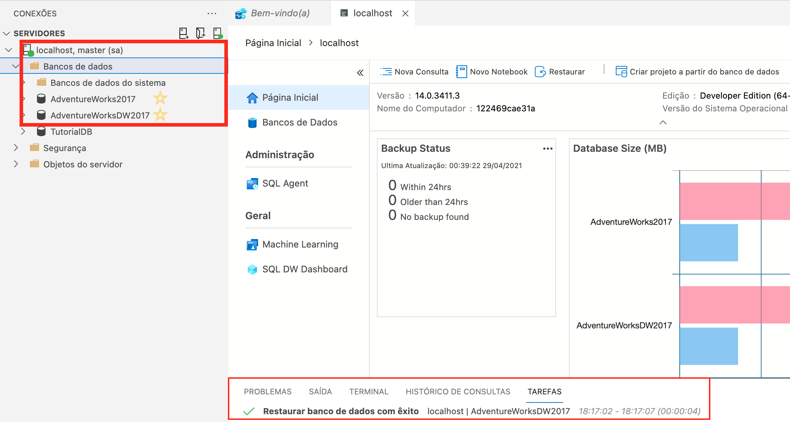

# Restauração de Backup no SQL Server via Azure Data Studio

Após concluídas as etapas pertinentes ao [Procedimento SQL Server](https://github.com/gassantos/MBA-SQLCourse/blob/main/SQLServer/Procedimento.md), será iniciar os banco de dados (OLTP e DW) a partir dos arquivos de backup **_AdventureWorks_** disponíveis para o SQL Server 2017.

Caso não tenha feito o download dos arquivos de backup mencionados, acesse os links abaixo:

* [AdventureWorks (OLTP)](https://github.com/Microsoft/sql-server-samples/releases/download/adventureworks/AdventureWorks2017.bak)
* [AdventureWorks (DW)](https://github.com/Microsoft/sql-server-samples/releases/download/adventureworks/AdventureWorksDW2017.bak)

## **A) Enviar arquivo para MSSQL (Docker)**

1. Vá até o diretório onde estão os arquivos de backup:

    Exemplo: ```bash cd ~/Downloads```

2. Acesse o *CONTEINER_ID* do MSSQL, executando:

    ```bash
        docker ps | grep mssql | awk {'print $1'}
    ```

3. E faça a cópia do arquivo de backup para o contêiner:

    ```bash
        docker cp "diretorio-backup-file" conteiner_id:/home
    ```

## **B) Restaurar backup via Azure Data Studio**

   1. Inicie o Azure Data Studio
   2. Vá em **SERVIDORES** e clique em **localhost** para conectar à instância
   3. Clique com o botão direito em *localhost* e vá em **Gerenciar**
   4. Agora você está na **Página Inicial** do SGBD, conforme a imagem:
   

Comece o processo clicando em **Restaurar**.

   1. Selecione o backup que será utilizado, conforme o diretório enviado via **_docker cp_**  e confirme em **OK**. 
   2. Na etapa seguinte, defina a fonte de restauração como ***Arquivo de backup***. 
   3. Após definida a fonte de restauração, as demais informações serão automaticamente preenchidas, então basta confirmar no botão **Restaurar**. 
   4. Agora é só aguardar a **Restauração finalizar** e correr pro abraço :wink: 

Procedimento de restore finalizado com sucesso :bowtie:
